This document introduces key Croquet concepts, serves as a companion to the tutorials found on our [Github](https://github.com/croquet/croquet-for-unity-tutorials) , as well as walking through other demo projects in order of complexity . If you have not already done so, please  join our [Discord server](https://croquet.io/discord/)  where we maintain a Unity channel for support and discussion.

Copyright 2023 Croquet Corporation

Licensed under the Apache License, Version 2.0 (the "License"); you may not use this file except in compliance with the License. You may obtain a copy of the License at [http://www.apache.org/licenses/LICENSE-2.0](http://www.apache.org/licenses/LICENSE-2.0)

Unless required by applicable law or agreed to in writing, software distributed under the License is distributed on an "AS IS" BASIS, WITHOUT WARRANTIES OR CONDITIONS OF ANY KIND, either express or implied. See the License for the specific language governing permissions and limitations under the License.

Version 0.91 Mar 21, 2024   Note: some inconsistencies from package 0.9.3

Introduction to Croquet for Unity
=================================

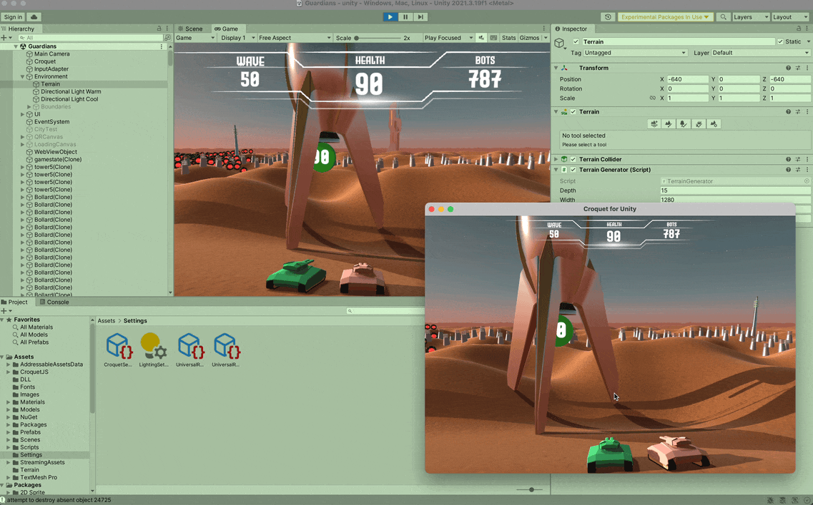

This is Guardians - which will be covered in a later section of this document. It has up to 1000 perfectly synchronized bots, missiles, and avatar tanks. You can try the  web version of the game right now here: [https://croquet.io/guardians/](https://croquet.io/guardians/)

Croquet for Unity was designed to enable complex multiplayer capabilities within Unity without the need to set up servers or write any netcode. It uses the Croquet bit-identical synchronized computation platform written in JavaScript, and a bridge to the Unity application which uses C#. This is a relatively seamless system, though of course it does require you to have a working knowledge of JavaScript and will require some additional setup.

There are ten tutorials that cover the fundamentals of creating a multiplayer game in Croquet for Unity, as well as a fully working game called Guardians that provides an example of an end-to-end application.

Why JavaScript?
===============

Croquet depends on a guarantee of deterministic computation across multiple platforms, as well as the ability to take a snapshot of the full program state, and dynamically recreate that state from a snapshot on a different machine. The object-oriented synchronous subset [\[1\]](#ftnt1)   of JavaScript  provides these guarantees and is the most widely available language across platforms. JavaScript is single threaded, which further eliminates race conditions which can also cause divergence in computations. Even so, certain operations like transcendental functions (e.g. sine , cosine , etc.) do not guarantee that the low-order bits on different systems are identical. The Croquet system patches these operations to ensure that they are. Finally, Croquet also provides a deterministic Math.random() function to again ensure identical calculations.

Basic Operation
===============

Worldcore  is a framework built on top of the Croquet kernel. It makes it particularly easy to create and animate objects within Croquet worlds. Worldcore utilizes a model-view  design pattern. In this case, the model  is the synchronized computation that is guaranteed to run bit identically on all participating users’ systems. In the case of Croquet for Unity, this is the JavaScript part of the system. The view  provides the visual representation of the model as well as the interface (this is often referred to as model/view/controller). Croquet guarantees that the model will run identically on any system - including Windows, Macintosh, Android and iOS. This means that any game created with Croquet for Unity enables multiplayer between phones, tablets, computers and potentially console devices. This is particularly useful for Unity applications, as Unity can target many different systems. It does mean that the programmer will need to build part of their application in JavaScript.

The elements that make up the model are called actors . Actors are JavaScript objects that are the basis of the shared simulated state. The Unity view side is made of Unity game objects that we will refer to as pawns. Pawns are instantiated  and destroyed on demand as Croquet Worldcore actors come in and out of existence. When you join a session that is currently in progress, or has been run at some time in the past, pawns will be created for all the actors in the active session, and be kept in sync from then on.

Simulation and animation: future messages
-----------------------------------------

Croquet provides a shared clock for all participants in a multiplayer game. It can be accessed as `this.now()`. All model computation is driven by this shared clock. The `future()`   message  is the key to multiplayer simulations and animations. It specifies that the function `doSomething()` will be called in a certain number of milliseconds in the future. This allows you to specify an action at regular intervals - for example, having the bots move through the world at a regular pace.

A particularly useful pattern is to have a message called via a future message call itself in another future message.  Thus, we might have something like this:

```js
doSomething() {
    // do something here
    this.future(100).doSomething();
}
```

This means that `doSomething()` will be called every 100 milliseconds. But more importantly, the `doSomething()` function is placed in a message queue within the Croquet model. Thus, when we take a snapshot of the state of the Croquet model, the queue is included. When a new user joins that same session, this future message queue is included - so even the animations and simulations pick up exactly where it is on the other players systems.

*Note that even complex behaviors (like physics objects, intelligent bots, etc) produce zero networking overhead, because everything is deterministically driven off the shared Croquet clock.*

Publish/Subscribe
-----------------

The Croquet model and Unity view communicate using the publish/subscribe  pattern. There is no direct communication between players (views on different machines), they all communicate only with the shared model.

A publish   from the Croquet model to the Unity view  goes directly across the Croquet bridge, so is received immediately. This is to inform the Unity pawns that something in an actor changed, and used to update the animations from simulations being performed within the model. Since it is local, bandwidth is not much of a problem.

A publish of user-generated events from a Unity view to a Croquet model  is the only valid non-deterministic input to the system, and will be replicated to all users. This is how your game can react to multi-user input while still producing exactly the same end result on every machine. The published event is sent via a Croquet reflector which attaches a timestamp and forwards the event to all participants in the same session.

The syntax of the publish function is:

```js
this.publish(scope, event, data);
```

Both  `scope` and `event` can be arbitrary strings. Typically, the scope would select the object (or groups of objects) to respond to the event,  and the event name would select which operation to perform.

A commonly used scope is `this.id` (in a model) and `model.id` (in a view) to establish a communication channel between a model and its corresponding view.

You can use any literal string as a global scope.

The syntax of the subscribe function is:

```js
this.subscribe(scope, event, handler);
```

The handler in the Croquet model must be a method of this, e.g. `subscribe("scope", "event", this.methodName)`  which will schedule the invocation of `this.methodName(data)` whenever `publish("scope", "event", data)`  is executed.

If `data` was passed to the publish call, it will be passed as an argument to the `subscribe` handler method. You can have at most one argument. To pass multiple values, pass an `Object` or `Array` containing those values. Views can only pass serializable data to models, because those events are routed via a reflector server.

*Note that unlike in traditional multiplayer approaches, with Croquet you do not have to publish anything  to keep model properties in sync across different machines. Croquet synchronizes computation itself, so your objects will already be up-to-date as the clock ticks.*

### Say/Listen

The   say/listen  pattern is a simplified version of publish/subscribe  that is used to communicate between a specific Croquet model and the associated Unity view. This enables you to send an event from your pawn to that pawn's specific actor on the model side, and vice versa. Under the covers, these are publish  and subscribe  invocations where the “scope” is set to the actor's model ID.

Level Building with Unity Editor
--------------------------------

If you build out a level in Unity using objects that have a manifest, Croquet will gather up the critical information for a level and handle distributing that information to other players.

Setting Up
==========

The [readme](https://github.com/croquet/croquet-for-unity-tutorials)  in the Github Repository is the best way to get started. This covers installation and successfully running your application. These tutorials are arranged as a set of scenes. Each scene builds upon the previous scene enabling more complex behaviors.

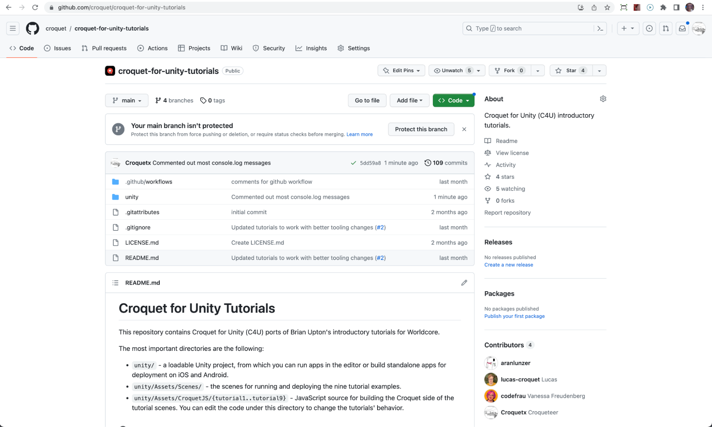

Unity Scenes, Systems and Prefabs
=================================

Once you have set up Croquet for Unity as described in the repository's readme (not forgetting to ensure that Build JS on Play  is selected on the editor's Croquet  menu) , you are ready to run the tutorials. Each tutorial has its own scene within the Unity project; double click on the scene you wish to run, and hit play.

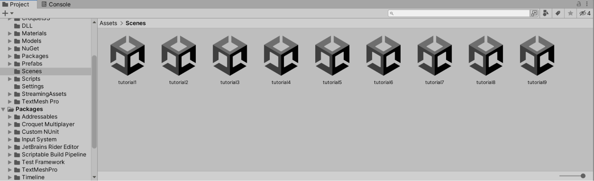

We now describe briefly the main pieces needed on the Unity side to run a Croquet for Unity app.

Every scene must include a GameObject that includes the components for setting up and managing communication with a Croquet JavaScript session. Here is a screenshot of that object in the scene for Tutorial 1 .

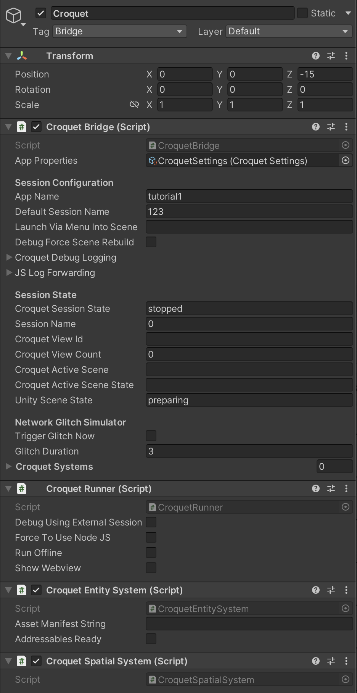

An inspector on the Croquet object in the Tutorial 1 scene.

The Croquet Bridge component specifies where to find the JavaScript code that this scene is designed to run with (the App Name  is used to locate the code under the project's Assets/CroquetJS   folder). Once the Croquet session is running, the Bridge handles all communication with it.

The Croquet Runner  is responsible for actually launching the Croquet session, using either an invisible WebView or an external browser (if Debug Using External Session  is checked) or – especially on Windows, where WebView is not currently supported – using Node.js.

In addition, every scene must include at least the Croquet Entity System , which manages the creation and destruction of Unity pawns under instructions from Croquet. Any scene with pawns that are placed in 3D (in other words, any interesting scene) needs the Croquet Spatial System  to manage that placement. Other such "systems" are introduced below.

Unity pawns are instantiated from prefabs, and use components that are specifically designed to work with the Croquet actors. Each prefab included in the Unity project has a Croquet Actor Manifest  where we define the features expected of any actor using this prefab (strictly, of the Worldcore view-side proxy for that actor, which handles communication between the actor and its Unity pawn).

Below is an inspector on the basicCube prefab. Because Worldcore classes make use of mixins to define their functionality, the principal property of the manifest is the Mixins  list. In this case it contains just Spatial , which is responsible for ensuring that the actor constantly communicates to Unity its translation (referred to in Unity as position), rotation, and scale. When this prefab is instantiated, the presence of Spatial  also results in attachment of a Croquet Spatial Component to the game object.

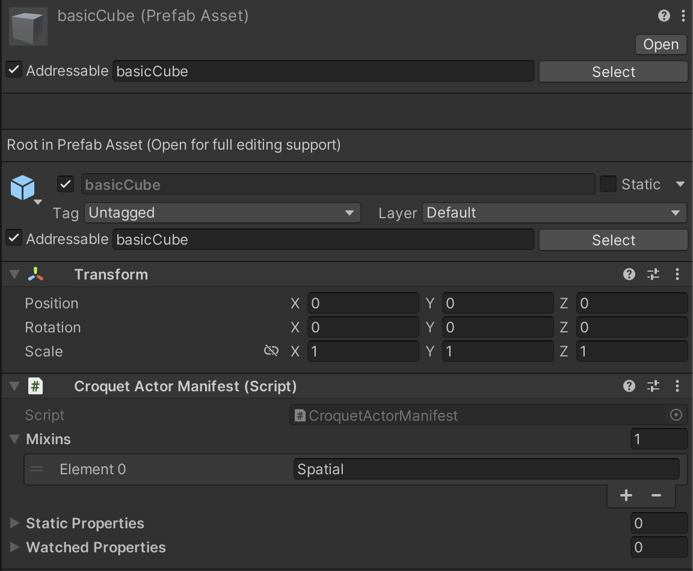

The following are all the mixins used in these tutorials:

Spatial:  a pawn that instantly snaps to its actor's placement at all timesSmoothed:  a pawn that moves smoothly to track the actor's placementMaterial:  to track material settings (currently just color)Interactable:  to detect user interactions on the pawn (currently pointer clicks)Avatar:  can be moved instantly by the local user, while announcing every move so that other users can see (with a small latency) the same changes

Both Spatial and Smoothed introduce a Croquet Spatial Component , which requires the presence of a Croquet Spatial System in the scene. The other three come with their own component/system pairs (e.g., Croquet Avatar Component , Croquet Avatar System ).

Here are the  various prefabs used throughout the tutorials, along with their included mixins and the tutorials they are used in:

| Prefab Name       | Mixin                          | Tutorials |
|-------------------|--------------------------------|-----------|
| basicCube         | Spatial                        | 1,2       |
| colorableCube     | Smoothed, Material             | 5,6       |
| groundPlane       | Spatial, Interactable          | 6,7,8,9   |
| interactableCube  | Smoothed, Interactable         | 6,7       |
| smoothedCube      | Smoothed                       | 2,3,4,5   |
| tutorial8Avatar   | Smoothed, Material, Avatar     | 8         |
| tutorial9Avatar   | Smoothed, Material, Interactable, Avatar | 9 |
| woodCube          | Smoothed, Material, Interactable | 7,8,9   |

NOTE: Prefabs for use by scenes will only be found if they have been added to the Default Local Group in Unity's Addressables manager. Each prefab must be tagged with labels naming all the scenes that are expected to use it, or the label "default" to mean that the prefab is available for all scenes. When a scene starts up, the prefabs available for that scene are listed in the Unity console.

Tutorials
=========

An introduction to Croquet for Unity one concept at a time. This is where to start diving in!

Concept Overview
----------------

### Tutorial 1: Hello World

Create a block that jumps sideways on hitting of z  and x keys.

*   Basic Setup
*   User Input
*   Model-Based Object Creation

### Tutorial 2: View Smoothing

T hree blocks (parent, child, grandchild) that slide smoothly on z and x keys.

### Tutorial 3: Using Behaviors

P arent and child, each spinning with their own Behavior

### Tutorial 4: Snap & Quaternions

S ame parent and child, now with additional n key to reset parent angle

### Tutorial 5: Adding Properties

Adding an  additional c key to change color.

### Tutorial 6: Pointer Interactions

Adding a ground plane with hit-testing to spawn/destroy objects.

### Tutorial 7: Creating Behaviors

Introduction to Behaviors.

*   W hen clicked, objects "die" by floating up and expanding

### Tutorial 8: Basic Avatars

Introduction to basic controllable avatars.

*   Giving each user a unique controllable avatar

### Tutorial 9: First-Person Avatars

Creating a first-person view, with mouselook navigation; can nudge other avatars, including driven ones

Tutorial 1
----------

How to set up your model root and view root, and how to create an object in the world.

Uses the basicCube prefab.


The foreground window is a Unity application built from this Tutorial 1 scene. It's important to note that these are distinct clients  immediately able to join the same multiplayer reality. This demonstrates how easy it is to create multiplayer experiences with Croquet. The x  and z  keys can be used to move the cube left and right.

Every object in Croquet for Unity is represented by an actor / pawn  pair. Spawning an actor automatically instantiates a corresponding pawn. The actor  is replicated across all clients, while the pawn  is unique to each client.

The code below defines a new class of actor . Actors  can be extended with mixins to give them new methods and properties. TestActor is extended by AM\_Spatial  ( A ctor M ixin Spatial) to give it a position in 3D space.

An actor's init method executes only once,   when the actor is first created in a brand new Croquet Session . In this TestActor's init we specify that it will use the “basicCube” prefab. We also create two subscriptions to listen for keyboard events. When any user presses 'z' the basicCube actor will instantly move to the left, while pressing 'x' moves it right. The corresponding Unity basicCube pawn will automatically move on all participating users’ systems. Think of it as the Croquet model and the Unity view sharing the object's translation. This movement will occur for all participants in this session.

All Worldcore actor  classes must be registered after they're defined.

The following code completely describes the multiplayer interactions of the Tutorial 1 scene. There is no netcode, and the Models.js file is short, even including comments. You can access this within the Unity Tutorials here:
Assets/CroquetJS/ tutorial1/Models
```js
class TestActor extends mix(Actor).with(AM_Spatial) {
    get gamePawnType() {
        return "basicCube";
    }

    init(options) {
        super.init(options);
        this.subscribe("input", "zDown", this.moveLeft);
        this.subscribe("input", "xDown", this.moveRight);
    }

    moveLeft() {
        console.log("left");
        const translation = this.translation;
        translation[0] += -0.1;
        this.set({translation});
    }

    moveRight() {
        console.log("right");
        const translation = this.translation;
        translation[0] += 0.1;
        this.set({translation});
    }
}

TestActor.register('TestActor');```
The init method of the model root - which, again, is only ever executed once in the entire lifetime of its Croquet session - assembles a basic scene, consisting of a single instance of TestActor.
```js
export class MyModelRoot extends ModelRoot {
    init(options) {
        super.init(options);
        console.log("Start model root!");
        this.test = TestActor.create({ translation: [0, 0, 0] });
    }
}

MyModelRoot.register("MyModelRoot");
```

Note : For  all but tutorial 9, the Unity game camera will be placed according to its transform settings in the editor. It would be perfectly possible to synchronize camera position between users, but we do not demonstrate that here.

Tutorial 2
----------

How to create parent-child relationships and use view smoothing, a first look at random numbers, and behavior implemented using future messages.

Uses the basicCube and smoothedCube prefabs.

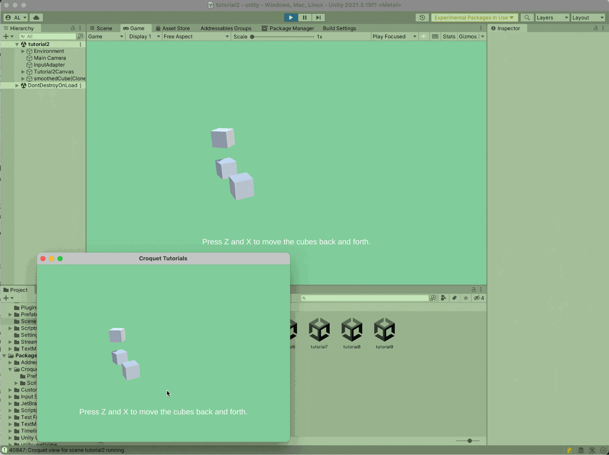
----------------------

Tutorial 2 illustrates parent/child relationships, as well as smoothed motion.

This time, we create three actors: a parent and two generations of children. The parent is defined to use the “smoothedCube” prefab. When you press the “x” and “z” keys, you will notice that the parent cube and its children move smoothly from one position to the next. A child's translation acts in relation to its parent.

```js
class ParentActor extends mix(Actor).with(AM_Spatial) {

    get gamePawnType() {
        return "smoothedCube";
    }

    init(options) {
        super.init(options);
        this.subscribe("input", "zDown", this.moveLeft);
        this.subscribe("input", "xDown", this.moveRight);
    }

    moveLeft() {
        console.log("left");
        const translation = this.translation;
        translation[0] += -1;
        this.set({translation});
    }

    moveRight() {
        console.log("right");
        const translation = this.translation;
        translation[0] += 1;
        this.set({translation});
    }
}

ParentActor.register('ParentActor');
```
For the children, we define a separate kind of actor - which doesn't subscribe to input events, but demonstrates basic Croquet time-based simulation by continuously spinning about the y axis.

In the init  method, the actor defines its own rate of spin using a call to Math.random . As discussed further in Tutorial 5, this call is guaranteed to generate the same number for every user in the session; every user's first ChildActor, for example, will spin with the same randomized rate.

The init  method then starts the spinning by calling doSpin , which applies a small delta to the actor's rotation property and then sends a future message to schedule another doSpin in 100 milliseconds' time. This keeps the spin going indefinitely.

```js
class ChildActor extends mix(Actor).with(AM_Spatial) {
    get gamePawnType() {
        return "basicCube";
    }

    init(options) {
        super.init(options);
        this.rate = Math.random() * 0.1 + 0.1;
        this.doSpin();
    }

    doSpin() {
        const q = q_axisAngle([0, 1, 0], this.rate);
        const rotation = q_multiply(this.rotation, q);
        this.set({rotation});
        this.future(100).doSpin(); // this is where the magic happens
    }
}

ChildActor.register("ChildActor");
```

Finally, we assemble the scene by creating the parent and the children, each child with a parent offset.

```js
export class MyModelRoot extends ModelRoot {

    init(options) {
        super.init(options);
        console.log("Start model root!");
        const parent = ParentActor.create({ translation: [0, 0, 0] });
        const child = ChildActor.create({ parent: parent, translation: [0, 0, 3] });
        const _grandchild = ChildActor.create({ parent: child, translation: [0, 2, 0] });
    }
}

MyModelRoot.register("MyModelRoot");
```

Tutorial 3
----------

How to use behaviors to control actors.

Uses the smoothedCube prefab.

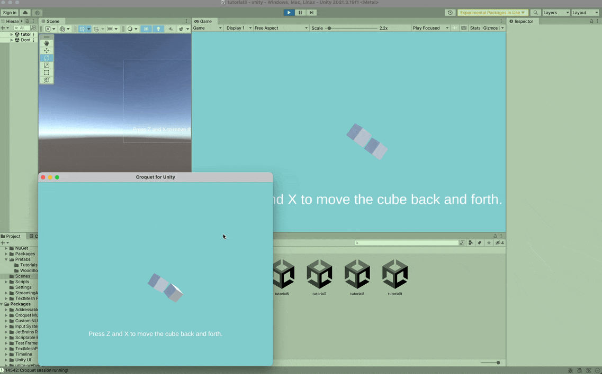

Tutorial 3 demonstrates behaviors to add synchronized simulations to objects.

AM\_Behavioral  lets us attach behaviors to actors to control them. Behaviors are themselves actors that control other actors (but require no visible manifestation, and therefore have no Unity pawn). They can be simple or quite complex. There are a number of predefined behaviors that you can use, and you can easily create new ones. The spin behavior simply spins the object around an axis, in effect encapsulating the effect that we achieved in our own code in the previous tutorial. You will see how to create your own behaviors in Tutorial 7.

```js
class ParentActor extends mix(Actor).with(AM_Spatial, AM_Behavioral) {
    get gamePawnType() { return "smoothedCube" }

    init(options) {
        super.init(options);
        this.subscribe("input", "zDown", this.moveLeft);
        this.subscribe("input", "xDown", this.moveRight);
    }

    moveLeft() {
        console.log("left");
        const translation = this.translation;
        translation[0] += -1;
        this.set({translation});
    }

    moveRight() {
        console.log("right");
        const translation = this.translation;
        translation[0] += 1;
        this.set({translation});
    }
}

ParentActor.register("ParentActor");
```

Again we define another actor that doesn't subscribe to input events.


```js
class ChildActor extends mix(Actor).with(AM_Spatial, AM_Behavioral) {
    get gamePawnType() { return "smoothedCube" }
}
```

This time, after creating the parent and the child we give each one its own spin behavior. When you start behaviors you can pass in options with the behavior name.

```js
export class MyModelRoot extends ModelRoot {
    init(options) {
        super.init(options);
        console.log("Start model root!");
        const parent = ParentActor.create({ translation: [0, 0, 0] });
        const child = ChildActor.create({ parent: parent, translation: [0, 0, 3] });
        const _grandchild = ChildActor.create({ parent: child, translation: [0, 2, 0] });
    }
}

MyModelRoot.register("MyModelRoot");
```

The source for SpinBehavior and other "provided" behaviors is available within worldcore's [behavior code](https://github.com/croquet/worldcore/blob/eed7ce3066f884ece62b55885fcfb7fb1ec8cffc/packages/kernel/src/Behavior.js%23L564) .

Tutorial 4
----------

How to use snap to override view smoothing, and how rotations are stored.

Uses the `smoothedCube` prefab.

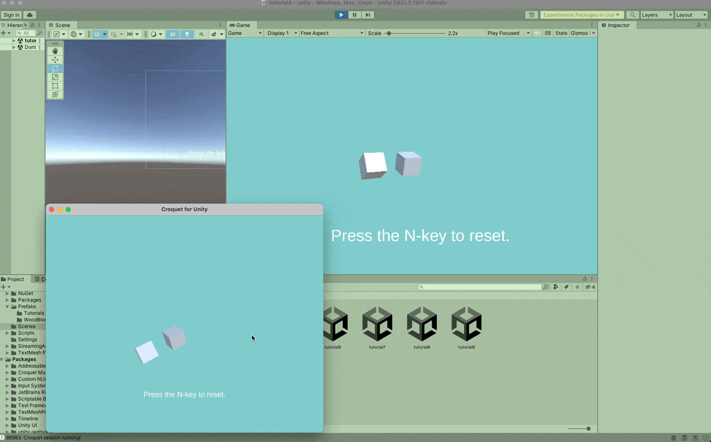

Tutorial 4 adds the feature of snapping the objects back to their original positions, from which they then continue their smoothed motion.

We add a reset method to pop the parent actor back to \[0,0,0\] and set its rotation to 45 degrees.

In the reset method we set the actor properties with snap() , instead of the set()  used up to now.   Snap  tells the pawn to use the new values without view smoothing; it's useful if you need to instantly teleport an actor to a new position.

Note  that we can snap the rotation and translation simultaneously, while the spin behavior continues from the actor's new orientation.

Worldcore stores rotations internally as quaternions; you can create new quaternions with helper functions like q\_euler()  or q\_axisAngle() .

```js
class ParentActor extends mix(Actor).with(AM_Spatial, AM_Behavioral) {
    get gamePawnType() {
        return "smoothedCube";
    }

    init(options) {
        super.init(options);
        this.subscribe("input", "zDown", this.moveLeft);
        this.subscribe("input", "xDown", this.moveRight);
        this.subscribe("input", "nDown", this.reset);
    }

    reset() {
        console.log("reset");
        const rotation = q_euler(0, 0, toRad(45));
        this.snap({rotation, translation: [0, 0, 0]});
    }
}

ParentActor.register("ParentActor");
```

Tutorial 5
----------

How to add new properties to actors, another use of random numbers, and how to transmit events with say() and listen().

Uses the colorableCube and smoothedCube prefabs.

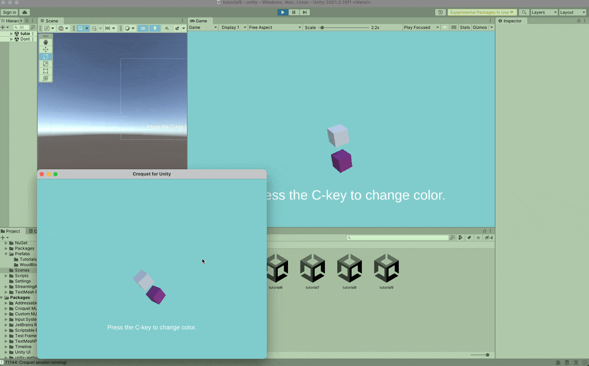

Tutorial 5 demonstrates how to dynamically modify object materials with the scene.

We add a color property to the ChildActor. This way of defining properties allows us to make use of all of Worldcore's built-in machinery for setting properties. The property is stored internally in an underline-prefixed variable. If we never set it, the getter returns its default value.

```js
class ChildActor extends mix(Actor).with(AM_Spatial, AM_Behavioral) {
    get gamePawnType() {
        return "colorableCube";
    }

    get color() {
        return this._color || [0.5, 0.5, 0.5];
    }
}

ChildActor.register("ChildActor");
```

When we create the child, we set its initial color to red.

We also added a handler in the model root to change the child to a random color whenever "c" is pressed. Anytime you call random()  in the model it returns the same value for every user in the session. That means that although the new color is random, it's the SAME random color for every user. All the clients stay in sync.

```js
export class MyModelRoot extends GameModelRoot {
    init(options) {
        super.init(options);
        console.log("Start model root!");
        this.parent = ParentActor.create({ translation: [0, 0, 0] });
        this.child = ChildActor.create({ parent: this.parent, color: [1, 0, 0], translation: [0, 2, 0] });
        this.parent.behavior.start({ name: "SpinBehavior", axis: [0, 0, 1], tickRate: 500 });
        this.child.behavior.start({ name: "SpinBehavior", axis: [0, -1, 0], speed: 3 });
        this.subscribe("input", "cDown", this.colorChange);
    }

    colorChange() {
        const color = [this.random(), this.random(), this.random()];
        this.child.set({color});
    }
}

MyModelRoot.register("MyModelRoot");
```

This tutorial depends on the colorableCube prefab, which includes the Material  mixin and declares color  as a watched property. The Material System receives notifications whenever the color value changes on an object that has a Material Component , and automatically updates the color on any materials found on the object. For now, color is the only property handled by this system, but in the future it will be extended to offer a range of material properties and features across all HDRP and URP pipelines.

Tutorial 6
----------

How to use the Interactable mixin to receive pointer-hit events.

Uses the colorableCube, interactableCube and groundPlane prefabs.

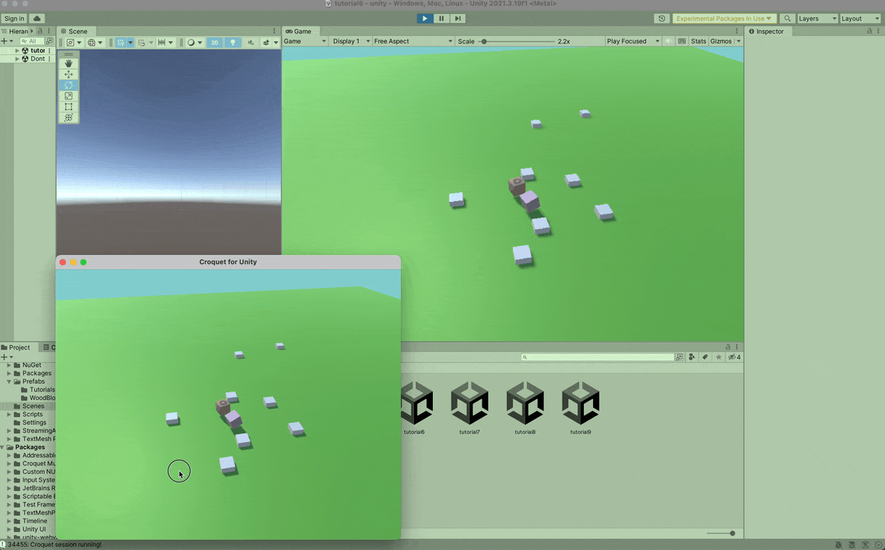

Tutorial 6 demonstrates direct user interactions to both dynamically create and destroy objects within the scene.

We add a BaseActor class that is shown as a ground plane. Its pawn includes the Interactable  mixin.

The Croquet Interactable System  that appears on the Croquet  object in this scene provides click detection for all objects that have the Croquet Interactable Component . On a pointer-down interaction, the system performs a raycast and publishes a "pointerHit" event listing all interactable game objects along that ray, sorted by increasing distance. The bridge to JavaScript figures out the corresponding actors, and publishes an event that goes via the reflector to every client's model.

In this tutorial, the BaseActor is the only one that subscribes to "pointerHit" events. It looks at the first actor in the supplied list. If that actor is itself, it spawns a new child at the clicked point, assigning it a "layers" property value - an array of strings - that will be provided if that actor appears in a future pointerHit event.

If the first hit is not the BaseActor, but another actor whose "layers" property shows that it was spawned by the BaseActor, we publish a "kill" event that the spawned actor will respond to by destroying itself.

```js
class BaseActor extends mix(Actor).with(AM_Spatial) {
    get gamePawnType() {
        return "groundPlane";
    }

    init(options) {
        super.init(options);
        this.subscribe("input", "pointerHit", this.doPointerHit);
    }

    doPointerHit(e) {
        const { actor, xyz, layers } = e.hits[0];
        if (actor === this) {
            this.doSpawn(xyz);
        } else if (layers.includes('spawnedByBase')) {
            this.publish(actor.id, 'kill');
        }
    }

    doSpawn(xyz) {
        TestActor.create({ parent: this, layers: ['spawnedByBase'], translation: xyz });
    }
}

BaseActor.register('BaseActor');
```

TestActor now uses "interactableCube" as its pawn type, which also includes the Interactable  mixin. However, as mentioned above, this TestActor does not handle any "pointerHit" events itself. It subscribes only to the "kill" event with the actor's own id as scope, if and when published by the BaseActor.

```js
class BaseActor extends mix(Actor).with(AM_Spatial) {
    get gamePawnType() {
        return "groundPlane";
    }

    init(options) {
        super.init(options);
        this.subscribe("input", "pointerHit", this.doPointerHit);
    }

    doPointerHit(e) {
        const { actor, xyz, layers } = e.hits[0];
        if (actor === this) {
            this.doSpawn(xyz);
        } else if (layers.includes('spawnedByBase')) {
            this.publish(actor.id, 'kill');
        }
    }

    doSpawn(xyz) {
        TestActor.create({ parent: this, layers: ['spawnedByBase'], translation: xyz });
    }
}

BaseActor.register('BaseActor');
```

This example demonstrates two types of event distribution, with important differences. An event from the Unity side  (whether generated by a system, as in the case of "pointerHit", or by a pawn using Say or Publish ) must travel via the reflector so that every client receives the event. On the other hand, an event that is published by an actor  (such as the "kill" event here) is processed immediately and synchronously by any other actor that subscribes to it, with no reflector journey involved. Such actor-to-actor events are a highly efficient way to achieve loose coupling between the entities involved.

The end result is that raycasting only needs to happen in the view of the client who actually clicked the pointer, but all clients respond identically to that click.

Tutorial 7
----------

How to create your own behaviors.

Uses the groundPlane and woodCube prefabs.


Tutorial 7 demonstrates how to create new objects with developer defined behaviors and how the objects can self destruct .

Behaviors are simply actors without a spatial location or a pawn, so defining a new behavior is like defining a new actor. Every behavior has a pointer to the actor it's controlling.

Most of the time, when you define a new behavior all you need to do is write two methods:

*   onStart()  runs once when the behavior starts
*   do()  runs every time the behavior ticks

The delta value passed to do() is the time in milliseconds since the last tick. At some point a behavior should either call this.succeed()  or this.fail() . Both destroy the behavior and inform the behavior's parent of its completion status. A behavior that doesn't succeed or fail will run until its actor is destroyed or until the behavior is explicitly destroyed by the actor.

```js
class InflateBehavior extends Behavior {
    get size() {
        return this._size || 3;
    }

    get speed() {
        return this._speed || 0.5;
    }

    onStart() {
        this.inflation = this.actor.scale[0];
    }

    do(delta) {
        this.inflation += this.speed * delta / 1000;
        this.actor.set({ scale: [this.inflation, this.inflation, this.inflation] });
        if (this.inflation > this.size) this.succeed();
    }
}

InflateBehavior.register('InflateBehavior');

class RiseBehavior extends Behavior {
    get height() {
        return this._height || 3;
    }

    get speed() {
        return this._speed || 0.5;
    }

    onStart() {
        this.top = this.actor.translation[1] + this.height;
    }

    do(delta) {
        const y = this.speed * delta / 1000;
        const translation = v3_add(this.actor.translation, [0, y, 0]);
        this.actor.set({translation});
        if (translation[1] > this.top) this.succeed();
    }
}

RiseBehavior.register('RiseBehavior');
```

Now when a TestActor is killed, instead of just destroying itself it launches a suite of behaviors to float up and inflate until it pops.

When you start several behaviors on the same actor by default they run concurrently, but composite behaviors allow you to combine behaviors in different ways.

For example, SequenceBehavior  runs a list of other behaviors in order. It only starts the next behavior when the previous one succeeds. Here we use a SequenceBehavior to destroy the actor after it inflates to maximum size.

```js
class TestActor extends mix(Actor).with(AM_Spatial, AM_Behavioral) {
    get gamePawnType() {
        return "interactableCube";
    }

    init(options) {
        super.init(options);
        this.subscribe(this.id, "kill", this.doKill);
    }

    doKill() {
        if (this.dying) return; // Prevent an actor from being killed twice
        this.dying = true;
        const translation = v3_add(this.translation, [0, 2, 0]);
        this.set({translation});
        this.behavior.start({ name: "RiseBehavior", height: 4, speed: 2 });
        this.behavior.start({ name: "SpinBehavior", axis: sphericalRandom(), speed: 0.2 });
        this.behavior.start({
            name: "SequenceBehavior",
            behaviors: [
                { name: "InflateBehavior", size: 4, speed: 0.2 },
                "DestroyBehavior"
            ]
        });
    }
}

TestActor.register('TestActor');
```

Tutorial 8
----------

How to create avatars.

Uses the groundPlane, woodCube and tutorial8Avatar  prefabs.

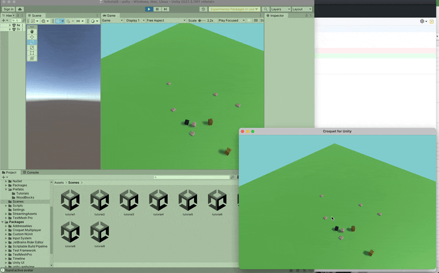

Tutorial 8 provides the first avatars to move and interact with the world. Each user controls their own avatar of course.

We add the AM\_Avatar mixin to the new AvatarActor. Avatars have a driver property that holds the viewId of the user controlling them.

```js
class AvatarActor extends mix(Actor).with(AM_Spatial, AM_Avatar) {
    get gamePawnType() {
        return "tutorial8Avatar";
    }

    get color() {
        return this._color || [0.5, 0.5, 0.5];
    }
}

AvatarActor.register('AvatarActor');
```

UserManager is a model-side service that creates a special user actor whenever someone joins the session. You can query the UserManager to get a list of all current users, but right now we're going to use the user system to spawn an avatar.

```js
class MyUserManager extends UserManager {
    get defaultUser() {
        return MyUser;
    }
}

MyUserManager.register('MyUserManager');
```

When someone joins a session, a new user is created for them. When it starts up, the user creates an avatar that only that person can use. We randomly generate a color for the user, so we'll be able to tell avatars controlled by different people apart.

```js
class MyUser extends User {
    init(options) {
        super.init(options);
        const base = this.wellKnownModel("ModelRoot").base;
        this.color = [this.random(), this.random(), this.random()];
        this.avatar = AvatarActor.create({
            parent: base,
            driver: this.userId,
            color: this.color,
            translation: [0, 1, -10]
        });
    }

    destroy() {
        super.destroy();
        if (this.avatar) this.avatar.destroy();
    }
}

MyUser.register('MyUser');
```

A crucial behavior provided by the avatar is for a client to "drive" the avatar that is currently assigned to it. Driving means that the client updates the avatar position in its own view instantly (without a round-trip journey to the reflector), while also emitting position-update events that travel via the reflector to all clients. When such an event arrives back at the particular client that sent it, Worldcore recognizes that on this client the move has already happened, so the event can be ignored. All other clients update their local manifestations of the same pawn, using view smoothing.

The tutorial8Avatar  prefab used for the avatar in this scene includes the Overhead Avatar  component, that watches for movement keys (W, A, S, D or arrows), moves the local game object immediately, and sends over the bridge the events that will be used by other clients to synch to this avatar's position updates.

Tutorial 9
----------

How to create a third-person avatar, and enabling users to “shove” other avatars.

Uses the groundPlane, woodCube and tutorial9Avatar  prefabs.

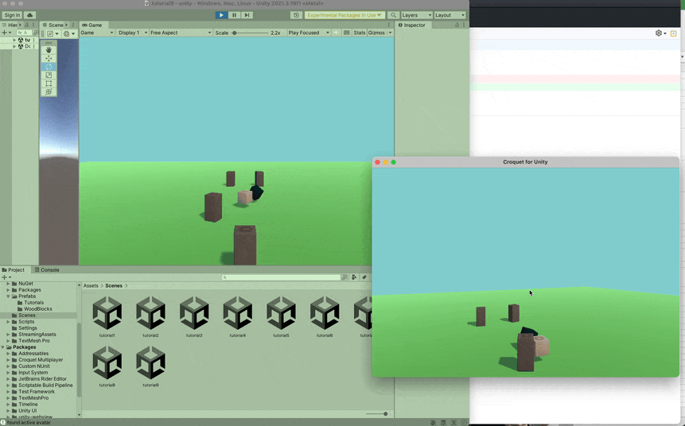

Tutorial 9 has a third-person avatar, with the ability (not shown here) to shove other avatars.

The interaction supported by this tutorial is that when I click on some avatar other than my own, I push that avatar a small distance away from me. Two extra, driverless avatars are placed in the scene just to be pushed around.

To implement this we add " pointerHit" handling  to the AvatarActor. When a pointerHit happens, every AvatarActor (driven or not) will receive the event. But according to the above rules, only the avatar whose user clicked in the scene needs to take any action. Because the event properties include the viewId of the originator, all we need to do is compare that viewId and the receiving actor's driver property. We can check whether the clicked object is an avatar by the presence of the "avatar" tag in its list of layers supplied by the hit event. The tutorial9Avatar  prefab explicitly includes its Interactable component, rather than having it instantiated automatically on creation, so that we could set its "interactable layers " property  to include " avatar" .

When there is an avatar to be shoved, we invoke its beShoved method directly (which is, of course, even more efficient than the actor-to-actor event used in Tutorial 6). If the avatar being shoved has a driver, we use a snap to impose its updated position, so as not to interfere with its user's control inputs.

The default color value defined for this actor, with its negative first value, ties in with a special interpretation in our Material System: if the first (i.e., red) value is -1, the color is ignored. This is useful when the prefab has a natural material state (in this case, a wood texture) that we would like to keep as-is unless and until an explicit color is applied.

```js
class AvatarActor extends mix(Actor).with(AM_Spatial, AM_Avatar) {
    get gamePawnType() {
        return "tutorial9Avatar";
    }

    get color() {
        return this._color || [-1, 0, 0];
    }

    init(options) {
        super.init(options);
        this.subscribe("input", "pointerHit", this.doPointerHit);
    }

    doPointerHit(e) {
        const originatingView = e.viewId;
        if (this.driver !== originatingView) return; // not this avatar's responsibility
        const { actor, layers } = e.hits[0];
        if (layers.includes('avatar') && actor !== this) {
            const away = v3_normalize(v3_sub(actor.translation, this.translation));
            actor.beShoved(away);
        }
    }

    beShoved(v) {
        const translation = v3_add(this.translation, v);
        if (this.driver) {
            this.snap({ translation }); // a driven avatar snaps
        } else {
            this.set({ translation }); // an undriven avatar lerps
        }
    }
}

AvatarActor.register('AvatarActor');
```

The Mouse Look Avatar  component that appears on that prefab asks the Croquet Avatar System  which object is the currently active avatar - which by default is set according to the avatar whose driver property matches the local viewId. If the script finds that the active avatar is not the object it's currently running on, it ignores all user interaction. Otherwise it responds to a combination of mouse and keyboard: when the right mouse button is down, the mouse continuously updates the yaw, while the WASD keys determine movement.

The third-person camera following is handled by two components added to this scene's main camera: Follow Cam places the camera relative to a designated game object in the scene, and Assign Follow Cam Target uses the active-avatar setting - again, queried from the Avatar System - to designate that target.

Sample Project: Demolition
==========================


----------------------

How to create a multiplayer game with hundreds of perfectly synchronized blocks in Croquet for Unity .  

Introduces the use of Rapier physics and Join Codes, Creating Custom Unity-Editor Scene-Based levels, and level progression management. Also demonstrates how C4U can support crossplay with a web app, in this case launched through a QR code.

The Croquet Demolition app is on github here: [https://github.com/croquet/croquet-for-unity-demolition](https://github.com/croquet/croquet-for-unity-demolition) .  See the releases page at [https://github.com/croquet/croquet-for-unity-demolition/releases](https://github.com/croquet/croquet-for-unity-demolition/releases)  for pre-built MacOS and Windows builds.

Demolition serves as a demonstration of multiplayer synchronized physics. Players shoot projectiles at block structures whose initial setup can be specified either procedurally in the model code, or by manual placement in the Unity editor, or as a combination of the two.  All physics calculations are carried out in the Croquet model, using the fully deterministic Rapier physics engine ( [https://rapier.rs/](https://rapier.rs/) ) to guarantee identical results for all players.

Demolition illustrates dramatically the benefit of fully client-side computation: a single missile-launch event sent via the reflector can be enough to trigger an explosion that sends hundreds of blocks flying through the air - but the choreography of those blocks' movements involves no further network traffic at all. Each player's Croquet client will compute exactly the same outcome .

This app includes a menu scene that lets a player specify a five-letter join code, or to request a new randomized code. Players who use the same join code will arrive in the same session, and can see each other's actions and their effects.

We have also implemented a web app that uses the same JavaScript model code as the Unity version, but has a simple THREE.js view in place of rendering with Unity. The web app is deployed to the Croquet website. Because they are based on the same model code, the two versions naturally support cross-play. The pre-built Unity standalone builds include a QR code: scanning this code will launch a web view into the same session that the Unity app is in. Although the rendering styles are very different, running the two versions side by side shows that all the projectiles and blocks are moving in perfect synchronization.


Sample Project: Guardians
============================


How to create a multiplayer game with a thousand perfectly synchronized bots, missiles and avatars in Croquet for Unity .  

Introducing Navigation Grid and a deep dive on Behaviors.

This section describes the Croquet for Unity Guardians application available on github here: [https://github.com/croquet/croquet-for-unity-guardians](https://github.com/croquet/croquet-for-unity-guardians) .  See the releases page at [https://github.com/croquet/croquet-for-unity-guardians/releases](https://github.com/croquet/croquet-for-unity-guardians/releases)  for pre-built MacOS and Windows builds.

Guardians is a simple cooperative game where players defend their rocketship which has landed in an alien, futuristic world. It was designed to demonstrate how to create a multiplayer game with a number of features including:

*   Multiplayer Avatar control
*   Up to 1000 semi-intelligent bots that run perfectly synchronized on all players' systems.
*   Firing of any number of missiles that interact with their environment by bouncing off objects and destroying bots, also perfectly synchronized.
*   A number of static object barriers that the avatars, bots and missiles interact with.

The bots and missiles are particularly interesting, as they demonstrate large numbers of perfectly synchronized simulated objects. This is where Croquet is especially powerful: you need only code the simulation, the movement of the object and its interaction with other objects within the world. There is no server management, and no netcode. Synchronization is automatic and perfect.

We also introduce navigation grids, which is a data structure used to quickly determine collisions among many objects.

Although Guardians takes place on a rolling sand dune world, the actual game design is completely 2D. All computations and collisions in the Croquet model are computed in a single plane. The view displays this flat data on a rolling hillside, and the objects all follow the terrain, but it has no effect on the game itself.

The next section is a deeper dive into the construction of these components.

Virtually all of the multiplayer game logic is in the Actors.js file.

Barriers and the Navigation Grid
--------------------------------

The avatars, bots and missiles interact with barriers in Guardians. Avatars collide with the bollards and the fins of the rocketship. The bots go around these without colliding. A missile will destroy a bot (and itself) if they collide, but will otherwise bounce off objects. As explained below, an avatar's interactions with the barriers are calculated locally, while missiles' and bots' interactions are calculated within the synchronized model.

A navigation grid is used in the Croquet model to place the barriers as well as to track the bots and missiles. An object can query the navigation grid to determine the barriers that are nearby and then compute whether the object is colliding with it or not. Some objects, like bollards and the spaceship, never move, but others like the bots and missiles are constantly moving and need to update their positions within the grid.

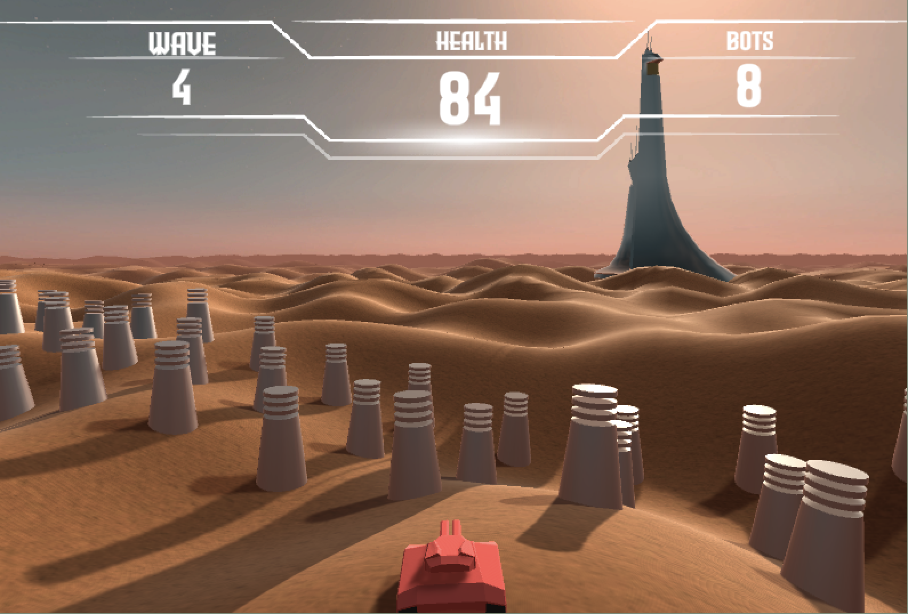

Bollards are static objects within the scene that the avatars collide with. The bots will avoid them and go around, and the spherical missiles will simply bounce off them.

We define the bollards and the towers within the scene with BollardActor and TowerActor respectively. These classes include AM\_Spatial as usual, along with AM\_OnGrid, which automatically inserts the object in the navigation grid for other objects to find it. The position of the object within the navigation grid is automatically updated as well, so you don’t need to update the avatar, bots or missiles yourself.

```js
//------------------------------------------------------------------------------------------
//--BollardActor, TowerActor ---------------------------------------------------------------
// Actors that place themselves on the grid so other actors can avoid them
//------------------------------------------------------------------------------------------

class BollardActor extends mix(Actor).with(AM_Spatial, AM_OnGrid) {
    get pawn() {
        return "BollardPawn";
    }

    get gamePawnType() {
        return "bollard";
    }

    get radius() {
        return this._radius;
    }
}
BollardActor.register('BollardActor');
```

The bollards are constructed within the init method of MyModelRoot, the final class in the file. The makeBollard function generates the bollard and specifies the tag “block” to be used by the navigation grid. We also specify obstacle: true , so that bots moving across the grid will collide with this object.

```js
makeBollard(x, z) {
    BollardActor.create({
        tags: ["block"],
        parent: this.base,
        obstacle: true,
        radius: 1.5,
        translation: [x, 0, z]
    });
}
```

Below is part of the inspector display for the bollard prefab. The Raise Align To Terrain script is a custom component, made for Guardians, that queries the scene's generated terrain object to find the height and slope at the point where the bollard has been placed. The properties in the "Raising" section in this case tell the script to place the bollard at exactly the terrain's height (zero extra, and zero random variation), and the "Alignment" section tells it to use a fraction (0.2) of the slope to set its angle off vertical .

This prefab is also equipped with a Collider and a Rigidbody, to generate a collision response when the tank acting as the local avatar collides with a bollard.

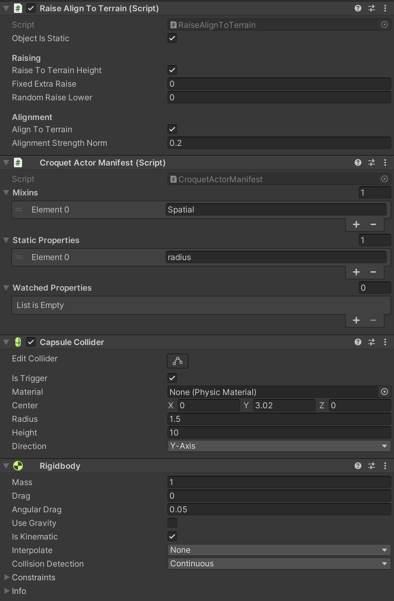

Avatars
-------

Avatars need to respond instantly to user controls and obstacle collisions. To achieve this, each user's avatar calculates its motion exclusively in that user's Unity view, and uses Croquet to inform other users of how the avatar has already moved. Those users will see the movements with a slight delay due to reflector latency, but the delay has no effect on gameplay. This is in contrast to the firing of a missile, on which all users must see exactly  the same effects: this is achieved by making every missile launch be a replicated event sent to the synchronized model. When any user clicks, or hits the spacebar, all users see the same newly generated missile set off on its assigned path.

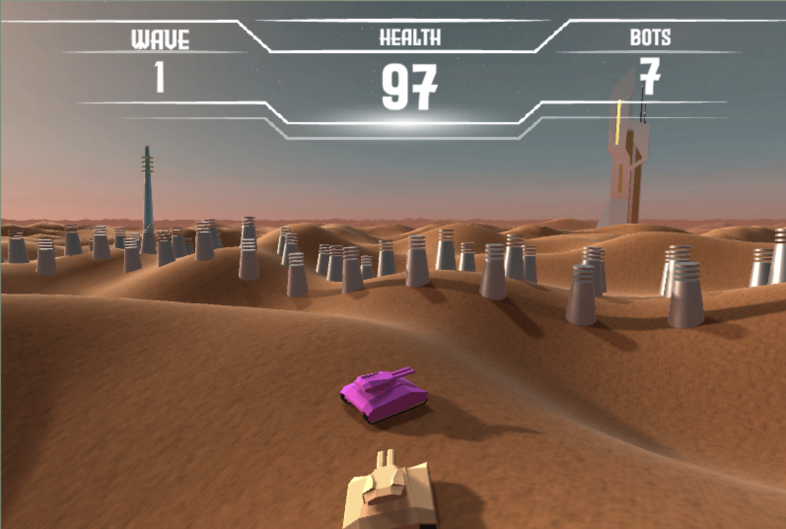

Multiple avatars. Each is controlled locally within Unity. This includes object collisions with the bollards and each other. Their location is automatically shared with other users.

Within the Croquet side of the game, the avatar actor reacts to when a user takes a shot, constructing a new missile and sending it on its way. It also enables a camera godMode when the user selects the G key. The rest of the avatar control is in the Unity avatar prefab.

```js
//------------------------------------------------------------------------------------------
//-- AvatarActor ---------------------------------------------------------------------------
// This is you. Most of the control code for the avatar is in the pawn in Avatar.js.
//------------------------------------------------------------------------------------------

class AvatarActor extends mix(Actor).with(AM_Spatial, AM_Avatar, AM_OnGrid) {
    get pawn() {
        return "AvatarPawn";
    }

    get gamePawnType() {
        return "tank";
    }

    init(options) {
        super.init(options);
        this.isAvatar = true;
        this.listen("shoot", this.doShoot);
        this.subscribe("all", "godMode", this.doGodMode);
    }

    get colorIndex() {
        return this._colorIndex;
    }

    doGodMode(gm) {
        this.say("doGodMode", gm);
    }

    doShoot(argFloats) {
        const [x, y, z, yaw] = argFloats;
        const aim = v3_rotate([0, 0, 1], q_axisAngle([0, 1, 0], yaw));
        const translation = [x, y, z];
        const missile = MissileActor.create({ parent: this.parent, translation, colorIndex: this.colorIndex });
        missile.go = missile.behavior.start({ name: "GoBehavior", aim, speed: missileSpeed, tickRate: 20 });
        missile.ballisticVelocity = aim.map(val => val * missileSpeed);
    }

    resetGame() {
        // this.say("goHome");
    }
}

AvatarActor.register('AvatarActor');
```

Below are some of the components on the "tank" prefab used for the avatar pawns in Guardians. In this case, the manifest declares the Avatar mixin to give the pawn the view-side-driven motion described above for the local avatar , and the Smoothed  mixin for responding to position updates when the tank is representing a remote  avatar - i.e., another user's. The also requests that the colorIndex  property (for which the getter is seen in the code fragment above) be supplied on object creation; this is used by the custom Set My Color From Index script that is also seen here. Finally, the custom Move Around script carries out the actual driving of the local avatar's position based on horizontal- and vertical-axis inputs (whether from keyboard or some other controller).

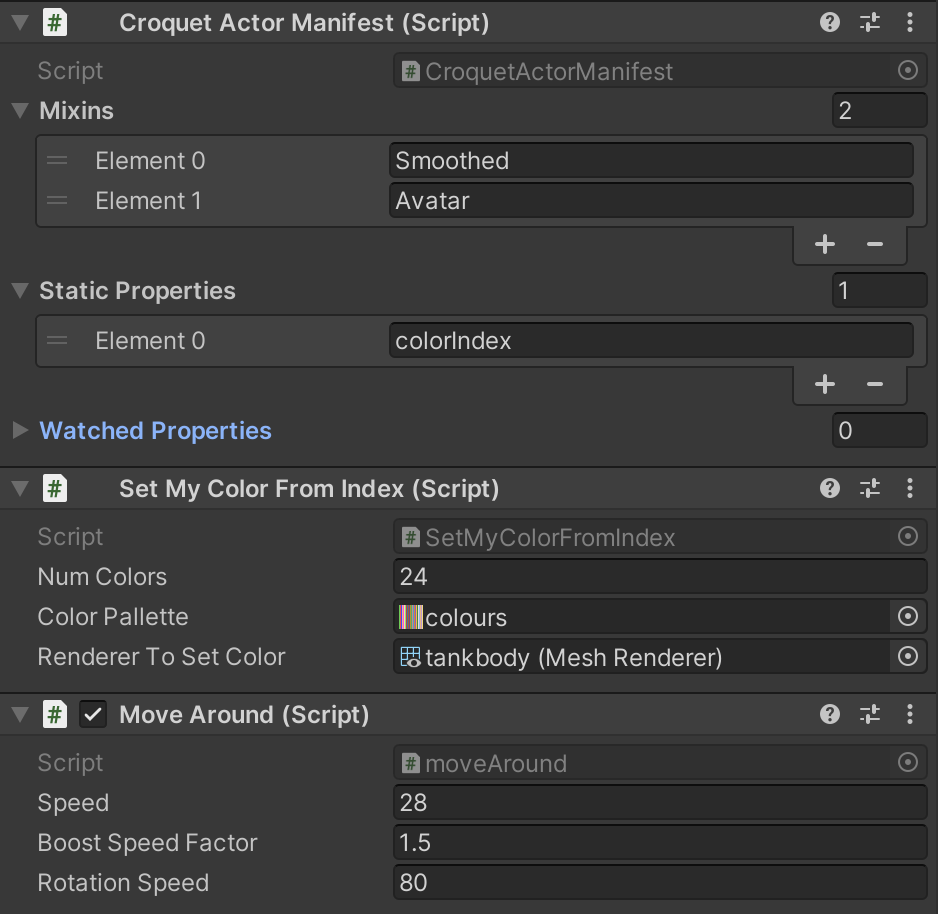

The tank prefab also includes a Sphere Collider for interacting with obstacles such as the bollards, and an Audio Source for generating the sound that accompanies a locally generated shot.

Bots
----

The bots attack the rocketship, but avoid everything else. They will move around the bollards and the avatars, and each other. When they get too close to any other moving object, they will move away from that object. This is where the navigation grid demonstrates its value. We may have as many as 1000 bots in a scene, and they are all avoiding each other and everything else.

 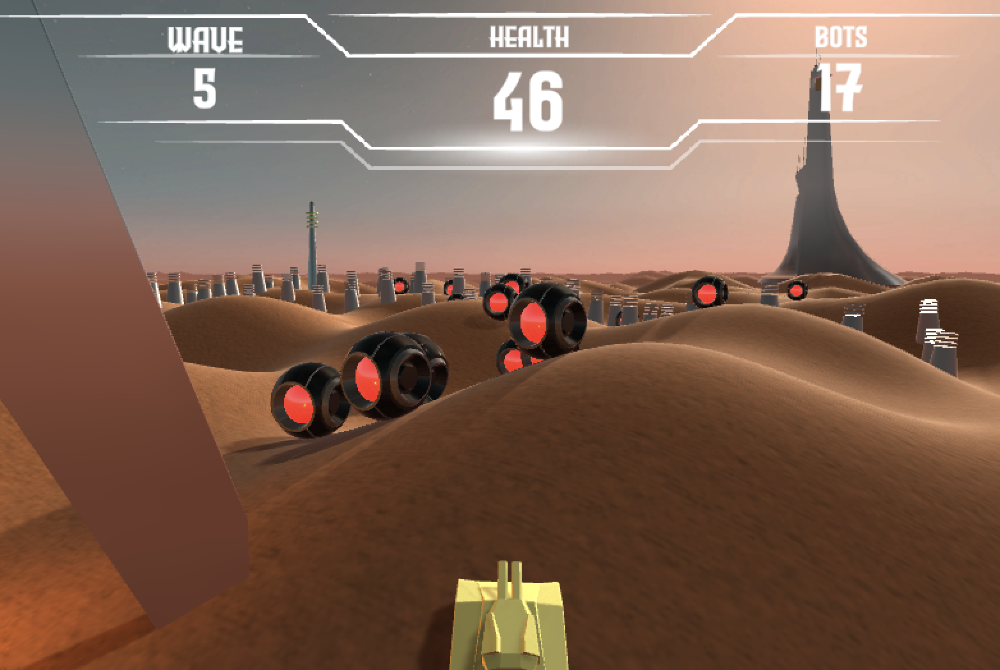 

The bots moving toward the rocketship. They move around the bollards and other barriers, and avoid the tanks.

Bots are generated in waves with the makeWave function in the MyModelRoot class. Waves are only generated if the game has not ended. Each wave has slightly more bots within it with a maximum total of 1000 bots in the world. The bots are generated coming from a random direction around the rocketship, with each bot adding a random delta to this direction (plus or minus) and a random distance to spread them out. Then each bot is generated at a random time offset using the future() message:

```js
this.future(Math.floor(Math.random() * 200)).makeBot(x, y, index);
```

The future message allows you to easily specify an offset to the current “now()” when an event will occur in the future. In this case, we are spreading out the generation of the bots randomly over a 200 millisecond time frame.

A new wave is generated every 30 seconds, so we use a similar future message for that.

```js
if (wave > 0) this.future(30000).makeWave(wave + 1, Math.floor(numBots * 1.2), key);
```

A wave value of 0 is for testing the system so can be ignored for now. This future message tells the system to run the same makeWave function we are inside of, but start 30 seconds from now(). The next wave will increase the number of bots generated by 20% or multiplying by 1.2.  

```js
makeWave(wave, numBots, key = this.gameState.runKey) {
    // filter out scheduled waves from games that already finished
    if (this.gameState.gameEnded || key !== this.gameState.runKey) return;
    const { totalBots } = this.gameState;
    let actualBots = Math.min(this.maxBots, numBots);
    if (totalBots + actualBots > this.maxBots) actualBots = this.maxBots - totalBots;
    const r = this.spawnRadius; // radius of spawn
    const a = Math.PI * 2 * Math.random(); // come from random direction
    for (let n = 0; n < actualBots; n++) {
        const aa = a + (0.5 - Math.random()) * Math.PI / 4; // angle +/- Math.PI/4 around r
        const rr = r + 100 * Math.random();
        const x = Math.sin(aa) * rr;
        const y = Math.cos(aa) * rr;
        const index = Math.floor(20 * Math.random());
        // stagger when the bots get created
        this.future(Math.floor(Math.random() * 200)).makeBot(x, y, index);
    }
    if (wave > 0) this.future(30000).makeWave(wave + 1, Math.floor(numBots * 1.2), key);
    this.publish("bots", "madeWave", { wave, addedBots: actualBots });
}
```

The makeBot() function generates the new bot at the x,z target location.

```js
makeBot(x, z, index) {
    const bot = BotActor.create({
        parent: this.base,
        tags: ["block", "bot"],
        index,
        radius: 2,
        translation: [x, 0.5, z]
    });
    return bot;
}
```

When the bot is first constructed the init() runs both the doFlee()  function, which is where it avoids other objects in the world, and the go()  function, which starts a behavior that moves it towards the rocketship. Behaviors were first introduced in Tutorial 3.

### init()

The init() function is used to set up the bot state, such as defining the interaction radius, and also makes the initial calls to doFlee()  and go(target) . These two functions regularly call themselves using the this.future(ms).go(target)  message.

```js
get pawn() {
    return "BotPawn";
}

get gamePawnType() {
    return "bot";
}

get index() {
    return this._index || 0;
}

init(options) {
    super.init(options);
    this.radius = 5;
    this.radiusSqr = this.radius * this.radius;
    this.doFlee();
    this.go([0, 0, 0]);
}
```

### go(target)

The BotActor is moving towards the rocketship at the center of the world while avoiding obstacles, and then destroys itself when it gets sufficiently close to the target. The movement toward the rocketship is done using the GotoBehavior, which simply moves an object at a regular speed toward a target. To use behaviors, we need to specify that the BotActor has the AM\_Behavioral mixin. The go()  function first checks to see if we have an active GotoBehavior, which we need to destroy first. We then generate a new GoBehavior with new random speed.

```js
go(target) {
    // console.log(target);
    if (this.ggg) {
        this.ggg.destroy();
        this.ggg = null;
    }
    const speed = (16 + 4 * Math.random());
    this.ggg = this.behavior.start({ name: "GotoBehavior", target, speed, noise: 2, radius: 1 });
}
```

### doFlee() and killMe()

The doFlee() function is where we enable the bots to avoid running into the bollards, the avatars and each other. It makes full use of the navigation grid. To start,the doFlee function determines if we are near (within 20 meters squared) of the rocketship. If so, then we call the killme()  function with onTarget as true. The killMe()  function generates the fireball pawn for the explosion, and then publishes that a bot was destroyed and onTarget was true - this is what alerts the rocketship that it has been damaged.

If the bot is still alive after that, the next section first uses a future message to have the doFlee()  function run again in 100 milliseconds. This means that the bot checks around itself 10 times a second to see if it is colliding with other objects. This rate can be increased by dropping the future()  argument. Thus, if you want to test at 20 times a second, call this.future(50).doFlee()  where we test every 50 milliseconds.

The next thing to do is find all of the “block” tagged objects near the bot. The pingAll(“block”)  function returns a list of all of the objects it finds within the local grid near the bot. A second argument to pingAll is the radius. In this case, we are simply testing whatever is in the same grid as the bot. We then iterate over this list and test if we are within the target radius. If so, we move away from it along the vector between the bot and the target object.

```js
killMe(s = 0.3, onTarget) {
    FireballActor.create({ translation: this.translation, scale: [s, s, s], onTarget });
    this.publish("bots", "destroyedBot", onTarget);
    this.destroy();
}

doFlee() {
    // blow up at the tower
    if (v_mag2Sqr(this.translation) < 20) this.killMe(1, true);
    // otherwise, check if we need to move around an object
    if (!this.doomed) {
        this.future(100).doFlee();
        const blockers = this.pingAll("block");
        if (blockers.length === 0) return;
        blockers.forEach(blocker => this.flee(blocker));
    }
}

flee(bot) {
    const from = v3_sub(this.translation, bot.translation);
    const mag2 = v_mag2Sqr(from);
    if (mag2 > this.radiusSqr) return;
    if (mag2 === 0) {
        const a = Math.random() * 2 * Math.PI;
        from[0] = this.radius * Math.cos(a);
        from[1] = 0;
        from[2] = this.radius * Math.sin(a);
    } else {
        let mag = Math.sqrt(mag2);
        if (bot.isAvatar) mag /= 2;
        from[0] = this.radius * from[0] / mag;
        from[1] = 0;
        from[2] = this.radius * from[2] / mag;
    }
    const translation = v3_add(this.translation, from);
    this.set({ translation });
}
```

When the game is over, the world is reset, so every temporary object in the scene needs to be destroyed. The resetGame()  function is called on all of these object . Here it removes the go behavior and destroys this bot. It is important to note that when you destroy an object on the Croquet actor side, it is automatically destroyed on the Unity view side.

```js
resetGame() {
    if (this.ggg) {
        this.ggg.destroy();
        this.ggg = null;
    }
    this.destroy();
}
```

Missiles
--------

Missiles have a lot of similarity to the bots. They too interact with most objects in the scene - bouncing off the regular blocking objects like the bollards, and also bouncing off the tanks (this is a co-op game, so we didn’t want to be killed by friendly fire). They destroy the bots when they collide with them.

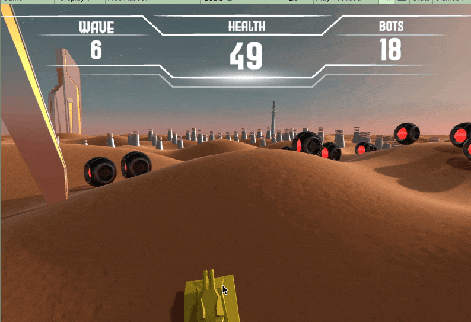

Where the bot behavior  is to always move toward the rocketship, the missiles simply move in a straight line from wherever they are fired. They destroy the bots, but bounce off everything else.

The missile is constructed by the avatar/user. When the user presses the spacebar or clicks (depending on the interface) a missile is generated within the AvatarActor doShoot(argFloats) function. Once the missile is constructed - using the same parent as the avatar which is the ground plane, we then add the “GoBehavior” behavior to the missile. This behavior simply has the missile move in a particular direction - forever, unless something affects it (see below).

```js
doShoot(argFloats) {
    // view is now expected to set the launch location, given that the launcher
    // can compensate for its own velocity
    const [x, y, z, yaw] = argFloats;
    const aim = v3_rotate([0, 0, 1], q_axisAngle([0, 1, 0], yaw));
    const translation = [x, y, z]; // v3_add([x, y, z], v3_scale(aim, 5));
    const missile = MissileActor.create({ parent: this.parent, translation, colorIndex: this.colorIndex });
    missile.go = missile.behavior.start({ name: "GoBehavior", aim, speed: missileSpeed, tickRate: 20 });
    missile.ballisticVelocity = aim.map(val => val * missileSpeed);
}
```

### The Missile init() and tick() functions

When the missile is first created by the avatar, the missile init()  function is called. We want to ensure that it doesn’t fly off into the horizon forever, so the first thing we do is set a four second time until the missile is destroyed with the   this.future(4000).destroy()  function. This means that four seconds after the missile is launched, if it hasn’t already hit a bot, it will be automatically destroyed on both the Croquet side and  the Unity side.

The last thing in the init()  is to call  this.tick() . This is the function that, like the bots above, tests the environment around it for collisions and responds accordingly. All that the   tick()  function does is call the   test( )  function and then, if the object hasn’t been destroyed, it calls the tick function (itself) again in 10 milliseconds with this.future(10).tick() .

```js
//------------------------------------------------------------------------------------------
//--MissileActor ---------------------------------------------------------------------------
// Fired by the tank - they destroy the bots but bounce off everything else
//------------------------------------------------------------------------------------------
const missileSpeed = 75;

class MissileActor extends mix(Actor).with(AM_Spatial, AM_Behavioral) {
    get pawn() { return "MissilePawn" }
    get gamePawnType() { return "missile" }

    init(options) {
        super.init(options);
        this.future(4000).destroy(); // destroy after some time
        this.lastTranslation = [0, 0, 0];
        this.lastBounce = null; // the thing we last bounced off
        this.tick();
    }

    resetGame() {
        this.destroy();
    }

    get colorIndex() { return this._colorIndex }

    tick() {
        this.test();
        if (!this.doomed) this.future(10).tick();
    }
}
```

### test()

The test() function is where the missile tests its environment for various collisions. It is already being moved by the “GoBehavior”, so we just need to regularly check the navigation grid for anything nearby. We first test for any bots nearby using the parent’s pingAny()  function. This function returns the first bot it finds nearby. If we find it to be within 4 (or 2 \* 2) squared distance away, then we have the bot kill itself with an onTarget flag of false this time - so it does no damage to the spaceship. The missile then destroys itself as well.

If it does not hit a bot, then we test against any “block” objects like the bollards or the avatars. Again, we call pingAny() on the objects on the grid tagged with “block”. We test to see if we have hit our own avatar immediately after firing - which can happen occasionally, due to the momentary differences that arise between an avatar's calculated position for its own user and its replicated position in the model. We ignore any such hit, but otherwise check to see if we hit the “block” and, if so, bounce off it. Bouncing involves destroying the current “GoBehavior” and creating a new one with its direction determined by the bounce.

```js
test() {
    const bot = this.parent.pingAny("bot", this.translation, 4, this);
    if (bot) {
        const d2 = v_dist2Sqr(this.translation, bot.translation);
        if (d2 < 4) { // bot radius is 2
            bot.killMe(0.3, false);
            this.destroy();
            return;
        }
    }
    // the blockers (tagged with "block") include all avatars
    const blocker = this.parent.pingAny("block", this.translation, 4, this);
    if (blocker) {
        if (!this.lastBounce && blocker.tags.has("avatar") && blocker.colorIndex === this.colorIndex) {
            // ignore own avatar when it's the first object we've encountered
        } else if (blocker !== this.lastBounce) {
            const d2 = v_dist2Sqr(this.translation, blocker.translation);
            if (d2 < 2.5) {
                // console.log("bounce", blocker);
                this.lastBounce = blocker;
                let aim = v3_sub(this.translation, blocker.translation);
                aim[1] = 0;
                aim = v3_normalize(aim);
                if (this.go) this.go.destroy();
                this.go = this.behavior.start({ name: "GoBehavior", aim, speed: missileSpeed, tickRate: 20 });
                this.ballisticVelocity = aim.map(val => val * missileSpeed);
            }
        }
    }
    this.lastTranslation = this.translation;
}

MissileActor.register('MissileActor');
```

The Game State Actor
--------------------

The game state actor is used to track the game state such as when new waves of bots are generated, starting and ending the game and updating the game stats - such as the health of the rocketship. Like any other actor in Croquet, it can subscribe to published messages, but it has no visible state itself.

```js
//------------------------------------------------------------------------------------------
//-- GameStateActor ------------------------------------------------------------------------
// Manage global game state.
//------------------------------------------------------------------------------------------

class GameStateActor extends Actor {
    get gamePawnType() { return "gamestate" }

    init(options) {
        super.init(options);
        this.subscribe("game", "gameStarted", this.gameStarted);
        this.subscribe("bots", "madeWave", this.madeBotWave);
        this.subscribe("bots", "destroyedBot", this.destroyedBot);
        this.subscribe("stats", "update", this.updateStats);
    }

    gameStarted() {
        this.runKey = Math.random();
        this.wave = 0;
        this.totalBots = 0;
        this.health = 100;
        this.gameEnded = false;
        this.updateStats();
    }

    madeBotWave({ wave, addedBots }) {
        this.wave = wave;
        this.totalBots += addedBots;
        this.updateStats();
    }

    destroyedBot(onTarget) {
        this.totalBots--;
        if (onTarget && !this.demoMode) {
            this.health--;
            this.publish("stats", "health", this.health);
            if (this.health === 0) {
                console.log("publish the endGame");
                this.gameEnded = true;
                this.publish("game", "endGame");
            }
        }
        this.publish("stats", "bots", this.totalBots);
    }

    updateStats() {
        this.publish("stats", "wave", this.wave);
        this.publish("stats", "bots", this.totalBots);
        this.publish("stats", "health", this.health);
        if (this.gameEnded) this.publish("user", "endGame");
    }
}

GameStateActor.register('GameStateActor');
```

Appendix 1: Worldcore Vector Package
====================================

Croquet Worldcore includes a simple vector package. All vectors, colors, quaternions and matrices used within the  model are simple JavaScript arrays. It also includes other useful functions.

The full package is included with Croquet for Unity, but can be viewed here:

[https://github.com/croquet/worldcore/blob/main/packages/kernel/src/Vector.js](https://github.com/croquet/worldcore/blob/main/packages/kernel/src/Vector.js)

[\[1\]](#ftnt_ref1)  Certain features of JavaScript violate these assumptions and cannot be used. In particular, closures (functions that “close over” variables) cannot be snapshotted and restored, which also prevents direct use of callbacks or async/await. Croquet provides alternatives to these language features.